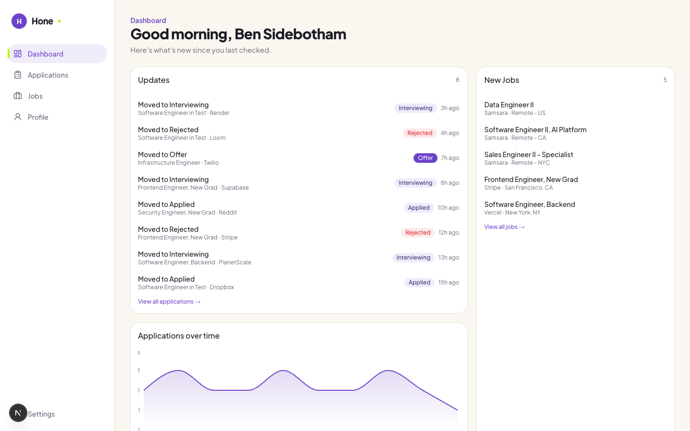
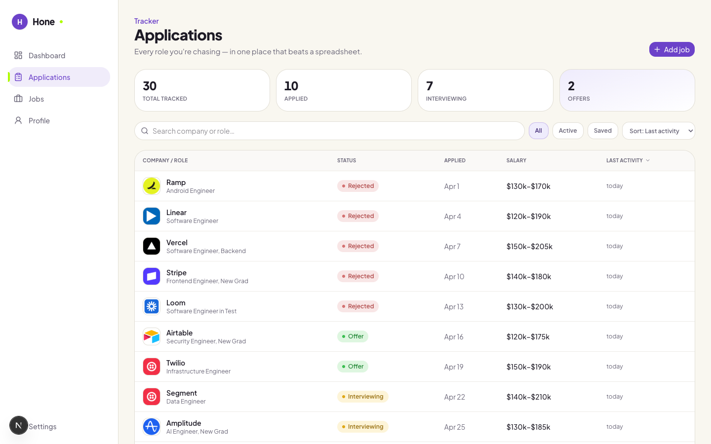
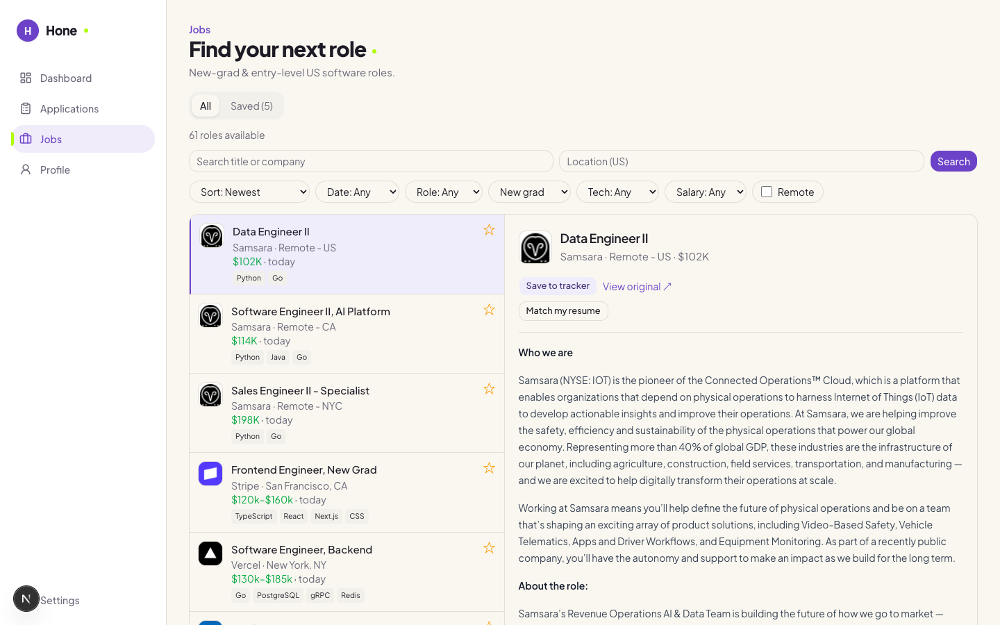

<div align="center">

# Hone

**Your job search, organized — track every application, catch fresh jobs daily, and sharpen your resume in one place that beats a spreadsheet.**

[](https://nextjs.org)
[](https://www.typescriptlang.org)
[](https://www.prisma.io)
[](https://neon.tech)
[](https://trigger.dev)
[](#testing)

[**Live demo**](https://your-live-url.vercel.app) · [Features](#features) · [Architecture](#architecture) · [Local setup](#local-development)

</div>

---

Hone is a full-stack job-search command center. It pulls fresh roles from company ATS boards and aggregators every hour, lets you track applications through a kanban or power-table, analyzes your resume / LinkedIn / personal site with AI, and surfaces it all as a daily digest. Connect Gmail and it reads your inbox to move applications to *Interviewing*, *Offer*, or *Rejected* automatically.

<div align="center">
  
</div>

## Features

- **📊 Daily dashboard digest** — an updates feed of what changed since your last visit, an application-volume trend chart, and a rail of newly posted jobs that match your search.
- **🗂️ Application tracker** — manage applications in a sortable/filterable power-table or a drag-and-drop kanban board; add roles manually or straight from the job feed; every status change is logged as an event.
- **🔎 Live job feed** — roles ingested hourly from company ATS boards (Greenhouse, Lever, Ashby, …) and aggregators, enriched with location, level, salary, and tech tags, with rich filtering and one-click save.
- **🤖 AI analysis (Gemini)** — upload a resume (PDF/DOCX) for an ATS-readiness score, keyword gaps, and prioritized suggestions; analyze a LinkedIn profile or personal site the same way.
- **📧 Gmail auto-updates** — opt-in Gmail connection reads job-search emails and updates the matching application's status automatically; high-confidence changes apply on their own, the rest surface as one-tap suggestions. *(Privacy-first: only job-relevant mail is ever read or stored.)*
- **🔐 Google sign-in** — Auth.js v5 with database-backed sessions.

## Tech stack

| Area | Choice | Why |
|---|---|---|
| Framework | **Next.js (App Router)** | Server Components + Server Actions keep data-fetching and mutations on the server with minimal client JS. |
| Language | **TypeScript** (strict) | End-to-end type safety from DB rows to React props. |
| Database | **Neon Postgres** + **Prisma** | Serverless Postgres over a typed ORM; schema-as-source-of-truth with migrations. |
| Auth | **Auth.js v5** (Google) | Database sessions via the Prisma adapter; incremental OAuth scopes for Gmail. |
| Background jobs | **Trigger.dev** | Durable scheduled tasks for hourly job polling and Gmail sync. |
| AI | **Google Gemini** (`gemini-2.5-flash`) | Structured JSON analysis of resumes, profiles, and emails. |
| UI | **Tailwind CSS** + **shadcn/Base UI**, **Recharts**, **dnd-kit**, **Motion** | Composable components, charts, drag-and-drop, and scroll animations. |
| Testing | **Vitest** + **Testing Library**, **Playwright** | Unit/logic coverage plus end-to-end specs across every page. |

## Architecture

```
┌─────────────────────── Next.js (App Router) ───────────────────────┐
│  Server Components  →  read via Prisma           (dashboard, jobs)  │
│  Server Actions     →  mutations + revalidation  (apply, status)    │
│  Route Handlers     →  uploads, OAuth callback, AI analysis         │
└───────────────┬─────────────────────────────────┬──────────────────┘
                │                                  │
        ┌───────▼────────┐                 ┌───────▼────────┐
        │  Neon Postgres │                 │  Google Gemini │
        │   via Prisma   │                 │  (analysis +   │
        └───────▲────────┘                 │  email class.) │
                │                          └────────────────┘
        ┌───────┴──────────────── Trigger.dev ──────────────┐
        │  poll-jobs  (hourly)   →  ingest ATS + aggregators │
        │  sync-gmail (15 min)   →  History API → classify   │
        └────────────────────────────────────────────────────┘
```

The **`ApplicationEvent`** table is the spine of the app: every status change — whether made by hand or detected from an email — is written there, and the dashboard's updates feed reads from it. That single log is what lets the Gmail integration surface in the UI without touching dashboard code.

## Screenshots

| Applications | Job feed |
|---|---|
|  |  |

## Local development

**Prerequisites:** Node 20.19+ / 22.12+, a Neon (or any Postgres) database, a Google OAuth client, a Gemini API key, and a Trigger.dev project.

```bash
# 1. Install
npm install

# 2. Configure environment
cp .env.example .env   # then fill in the values below

# 3. Set up the database
npx prisma migrate dev

# 4. Run the app (port 3050)
npm run dev

# 5. (optional) Run background jobs in a second terminal
npm run dev:trigger
```

Environment variables (`.env`):

| Variable | Purpose |
|---|---|
| `DATABASE_URL` / `DIRECT_URL` | Neon pooled + direct connection strings |
| `AUTH_SECRET` | Auth.js session encryption secret |
| `AUTH_GOOGLE_ID` / `AUTH_GOOGLE_SECRET` | Google OAuth client credentials |
| `GOOGLE_GENERATIVE_AI_API_KEY` | Gemini API key |
| `TRIGGER_SECRET_KEY` | Trigger.dev project key |

## Testing

```bash
npm test          # Vitest unit & logic tests
npm run test:watch
npm run e2e        # Playwright end-to-end specs
```

The suite covers scoring/matching logic, dashboard aggregation, application events, the Gmail pipeline (relevance gating, classification, matching, decisioning), and full-page e2e flows.

## Project structure

```
src/
  app/           # App Router routes: (app) authenticated area + landing
  components/    # UI, landing, and dashboard components
  lib/           # Domain logic — applications, jobs, resume, gmail, ai, health
  trigger/       # Trigger.dev scheduled tasks (poll-jobs, sync-gmail)
prisma/          # Schema + migrations
e2e/             # Playwright specs
```

---

<div align="center">
<sub>Built by <a href="https://github.com/Bensidebotham">Ben Sidebotham</a></sub>
</div>
